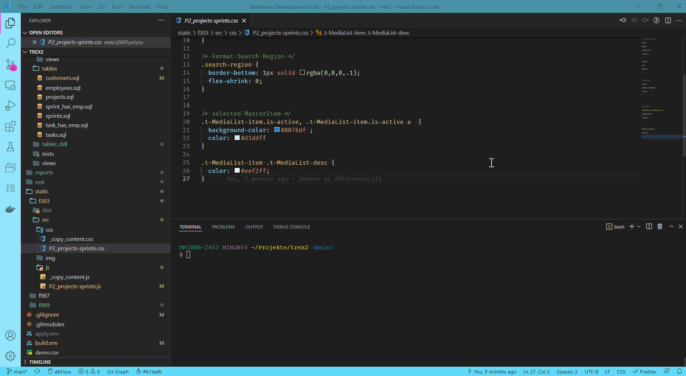

# dbFlow - Easy development flow for Oracle APEX Apps

Using this extension enables you to develop Oracle APEX applications in a simple flow

- Compile your PL/SQL Object to a specified connection
- Minify and upload your JavaScript Files to your APEX Application
- Minify and upload your Cascading Stylesheets to your APEX Application

#### Demo - Compiling PL/SQL Package


#### Demo - Uploading Javascript


#### Demo - Uploading CSS



## Prerequisites

- Install SQL\*Plus or SQLcl

## Configuration

dbFlow Extension is based on a specic file / folder structur. Either create this structure by using [dbFlow-Template](https://github.com/MaikMichel/dbFlow-template) or just make it on your own.

``` shell
apex              - all your apex apps goes here
  f123            - example: app 123
db
  data_schema_name  - Database User/Schema [optional]
  logic_schema_name - Database User/Schema [optional]
  app_schema_name   - Database User/Schema
    ...             - for each object type a folder
    sources
      packages
      functions
      procedures
    tables
    views
    ...
static            - static application files
  f123            - example: app 123
    src
      js          - place javascript files here
      css         - place css files here

apply.env         - this file MUST exists
build.env         - this fime MUST exists
```

Content of build.env

``` shell
# Use DB_APP_USER as Proxy to multischemas?
# otherwise connect directly as defined in apply.env
USE_PROXY=FALSE

# what are the schema-names, all the same when USE_PROXY is FALSE
DATA_SCHEMA=DB_SCHEMA_NAME_DATA
LOGIC_SCHEMA=DB_SCHEMA_NAME_LOGIC
APP_SCHEMA=DB_SCHEMA_NAME_APP
```

Content of apply.env

``` shell
# KEEP THAT FILE OUT OF GIT

# DB Connection
DB_TNS=localhost:1521/xepdb1

# Deployment User and Pass
DB_APP_USER=user_name
DB_APP_PWD=user_pwd
```


### Basic Workflow

**Setup**

- Open settings and choose your cli (SQL\*Plus or SQLcl)

**Compile**

- Open file
- call command `dbFlow: Compile current file` (Ctr+Alt+B)
  - PL/SQL compile towards DB connections
  - JSS minify, map and upload to APEX - Application Static Files
  - CSS minify, map and upload to APEX - Application Static Files
dbms_output enabled
