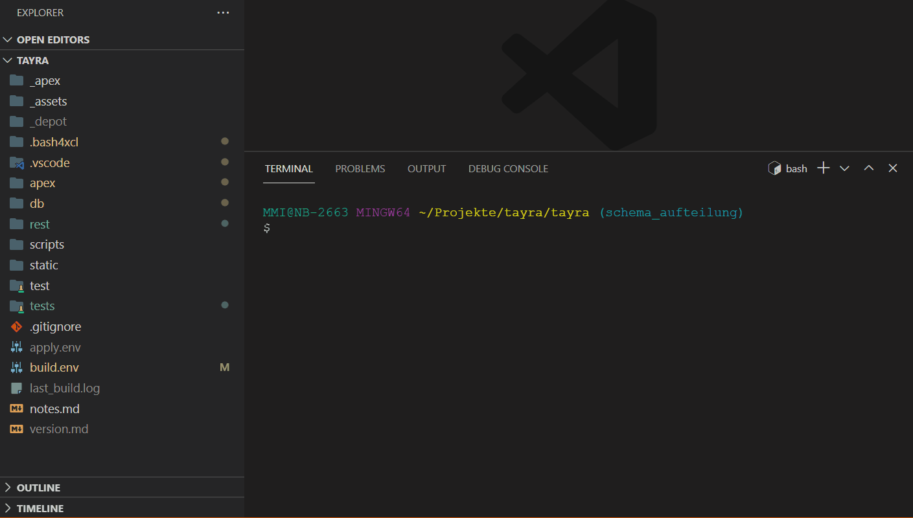

# dbFLux - Easy development flow for Oracle APEX Apps

Using this extension enables you to develop Oracle APEX applications in a simple flow

- Compile your PL/SQL Object to a folder specific connection
- Minify and upload your JavaScript Files to your APEX Application
- Minify and upload your Cascading Stylesheets to your APEX Application
- Upload any file to your APEX Application
- Run utPLSQL Test
- Runs additionaly with dbFlow and XCL


#### Demo - Compiling PL/SQL Package


#### Demo - Uploading Javascript


#### Demo - Uploading CSS


#### Demo - Running utPLSQL Tests


## Prerequisites

- Install git-bash (included when installing git)
- Install SQLcl
- SQL\*Plus [optional, but *faster* way to compile your code]


## Configuration

dbFLux Extension is based on a specic file / folder structur. Either create this structure by using [dbFLow-Template](https://github.com/MaikMichel/dbFLux-template) or just make it on your own.
Another way is to use XCL (currently in Alpha)

``` shell
apex              - all your apex apps goes here
  f123            - example: app 123
db
  data_schema_name  - Database User/Schema [optional]
  logic_schema_name - Database User/Schema [optional]
  app_schema_name   - Database User/Schema
    ...             - for each object type a folder
    sources
      packages
      functions
      procedures
    tables
    views
    ...
rest
  modules
    api.abc       - exported rest module
    api.xyz       - exported rest module
static            - static application files
  f123            - example: app 123
    src
      js          - place javascript files here
      css         - place css files here

apply.env         - if exists then Mode is dbFLow
build.env         - if exists then Mode is dbFLow
xcl.yml           - if exists then Mode is xcl
.xcl/env.yml      - if exists then Mode is xcl
```

Content of build.env

``` shell
# what are the schema-names, all the same when USE_PROXY is FALSE
DATA_SCHEMA=DB_SCHEMA_NAME_DATA
LOGIC_SCHEMA=DB_SCHEMA_NAME_LOGIC
APP_SCHEMA=DB_SCHEMA_NAME_APP
```

Content of apply.env

``` shell
# KEEP THAT FILE OUT OF GIT !!!

# DB Connection
DB_TNS=localhost:1521/xepdb1

# Deployment User and Pass
DB_APP_USER=user_name
DB_APP_PWD=user_pwd
```

> Keep apply.env out of git using `.gitignore`


### Basic Workflow

#### Setup

- Open settings and choose your cli (SQL\*Plus or SQLcl)
- If you want to display addional warnings just *enable* it by checking `Show warning messages after compiliation`
- You can hide warnings by adding warning-codes to the exclusion list
- You can define custom trigger runs by defining the following array in your workspace settings
  ```json
    ...,
    "dbFLux.customTriggerRuns": [
      {
        "triggeringExpression": "db\/trex\/(tables|tables_ddl)\/.+\\.sql",
        "runFile": "db/your_data/.hooks/post/build_table_api.sql",
        "runFileParameters": ["${fileBasename}", "param2", "param3"]
      },
      {
        "triggeringExpression": "db\/trex\/(tables|tables_ddl)\/.+\\.sql",
        "runFile": "db/your_logic/.hooks/post/grant_some_rules.sql"
      }
    ]
  ```
  - Triggering expression is meant to be a regexp to match a file when building by *compile-command*
  - Whenever a file is matched all runFiles will be executed by using the connection which belongs to the specified folder
  - optionally you can pass parameter alongside to it
  - parameters can use VSCode variables [https://code.visualstudio.com/docs/editor/variables-reference](https://code.visualstudio.com/docs/editor/variables-reference)
- When enabling `Create and upload JavaScript Minified Version` your file will be minified using terser
- When enabling `Create and upload JavaScript Source Map` a source map of your JavaScript file is created and uploaded addionaly
- When enabling `Create and upload CSS minified Version` your file will be minified using uglifycss


#### Compile code

- Open file
- call command `dbFLux: Compile current file` (Ctr+Alt+B)
  - inside db-Folder
    - SQL and PL/SQL compiled towards DB connections
  - inside static-Folder
    - JSS minify, map and upload to APEX - Application Static Files
    - CSS minify, map and upload to APEX - Application Static Files
    - inside static-Folder: upload file to APEX - Application Static Files
  - inside reports-Folder
    - File is prepared for uploading and merged with given template.sql inside child folder


#### Prepare upload

If you want to upload file to a specific table or service, place them inside the reports folder/subfolder ex.: `reports/docs`. Here you have to put a template file with the name template.sql in. This template is merged to to upload file. When calling command: `dbFLux: Compile current file` you are prompted for a filename and a target directory to place the resulting file in.

#### Demo - Create a report type, merge with template, move to target folder and compile


#### Execute utPLSQL Unittests

To run your tests just call command: `dbFLux: Execute utPLSQL tests`. All tests found are executed. If you are using the multischema configuration you are prompted to select the schemas to run your tests.


